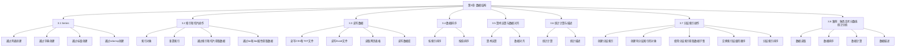

```mermaid
graph TD
    A[第3章: 数据结构] --> B[3.1 Series]
    A --> C[3.2 索引和切片操作]
    A --> D[3.3 读写数据]
    A --> E[3.4 数据排序]
    A --> F[3.5 算术运算与数据对齐]
    A --> G[3.6 统计计算与描述]
    A --> H[3.7 分层索引操作]
    A --> I[3.8 案例：陕西高考分数线统计分析]

    B --> B1[通过列表创建]
    B --> B2[通过字典创建]
    B --> B3[通过标量创建]
    B --> B4[通过ndarray创建]

    C --> C1[索引对象]
    C --> C2[重置索引]
    C --> C3[通过索引和切片获取数据]
    C --> C4[通过loc和iloc属性获取数据]

    D --> D1[读写CSV和TXT文件]
    D --> D2[读写Excel文件]
    D --> D3[读取网页表格]
    D --> D4[读写数据库]

    E --> E1[按索引排序]
    E --> E2[按值排序]

    F --> F1[算术运算]
    F --> F2[数据对齐]

    G --> G1[统计计算]
    G --> G2[统计描述]

    H --> H1[创建分层索引]
    H --> H2[创建有分层索引的对象]
    H --> H3[使用分层索引获取数据子集]
    H --> H4[交换索引层级的顺序]
    H --> H5[分层索引排序]

    I --> I1[数据读取]
    I --> I2[数据排序]
    I --> I3[数据计算]
    I --> I4[数据描述]
```