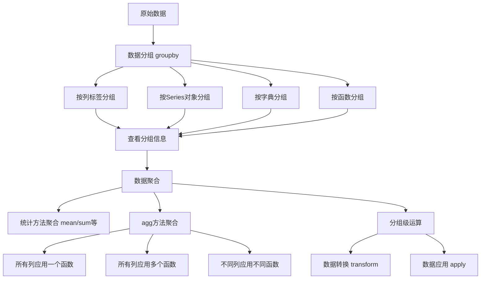
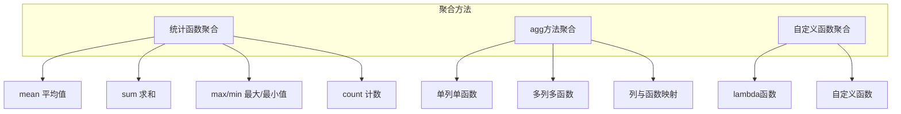
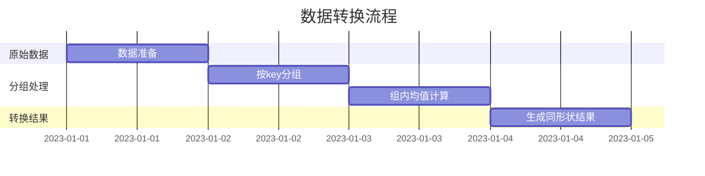

# 第5章 数据聚合与分组运算 可视化

## 主要内容概览

本章介绍了pandas中的数据分组、聚合和分组级运算的核心概念和操作方法。下面是本章内容的可视化展示：

## 数据分组与聚合流程



## 分组操作详解

| 分组方式 | 描述 | 示例代码 | 适用场景 |
|---------|------|---------|---------|
| 按列标签分组 | 根据DataFrame中的某一列或多列进行分组 | `df.groupby('key')` | 最常见的分组方式，根据数据的分类特征进行分组 |
| 按Series对象分组 | 使用外部Series对象作为分组依据 | `df.groupby(by=ser_obj)` | 需要根据外部定义的分类规则进行分组 |
| 按字典分组 | 使用字典定义列与分组的映射关系 | `df.groupby(group_dict, axis=1)` | 需要对列进行分组或自定义复杂的分组规则 |
| 按函数分组 | 使用函数的计算结果作为分组依据 | `df.groupby(by=len)` | 根据索引或数据的计算属性进行分组 |

## 数据聚合方法



## 分组级运算示例

### 数据转换（Transform）

数据转换会保持原始数据的形状，对每个分组内的数据进行相同的操作：



### 数据应用（Apply）

数据应用可以对每个分组执行任意操作，灵活性更高：

| 操作类型 | 函数 | 描述 |
|---------|------|------|
| 转换操作 | `transform` | 保持形状，返回与输入相同形状的对象 |
| 应用操作 | `apply` | 灵活操作，可返回任意形状的结果 |
| 过滤操作 | `filter` | 根据条件过滤分组 |

## 综合应用示例

下面是一个完整的数据分组、聚合和转换的工作流程：

```mermaid
digraph G {
    subgraph 输入数据
        df[DataFrame数据]
        key[分组键]
    }
    
    subgraph 分组阶段
        group[groupby分组]
        info[查看分组信息]
    end
    
    subgraph 聚合阶段
        agg1[统计聚合 mean/sum]
        agg2[agg聚合 多函数]
        agg3[自定义函数聚合]
    end
    
    subgraph 运算阶段
        transform[数据转换]
        apply[数据应用]
        result[最终结果]
    end
    
    df --> group
    key --> group
    group --> info
    group --> agg1
    group --> agg2
    group --> agg3
    group --> transform
    group --> apply
    
    agg1 --> result
    agg2 --> result
    agg3 --> result
    transform --> result
    apply --> result
}
```

通过本章的学习，我们掌握了如何使用pandas进行高效的数据分组操作、灵活的数据聚合以及强大的分组级运算，这些技能对于数据清洗、特征工程和统计分析都至关重要。