# 📊 第6章 数据可视化 可视化总结

## 🎯 章节概览

本章系统介绍了Python中三大主流数据可视化工具：**Matplotlib**、**Seaborn**和**Pyecharts**，并通过**电影数据分析案例**进行综合实践。

---

## 🏗️ 整体架构概览

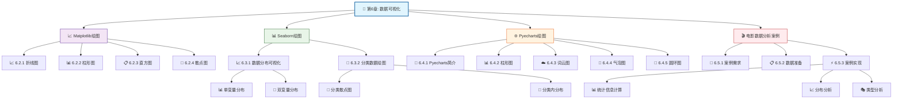

### 🔄 环形架构视图

```mermaid
flowchart LR
    subgraph "🔄 环形可视化架构"
        A[🎨 第6章: 数据可视化]
        
        subgraph "📊 核心工具层"
            B[📈 Matplotlib]
            C[📊 Seaborn]
            D[🌐 Pyecharts]
        end
        
        subgraph "🎯 应用实践层"
            E[🎬 电影数据分析]
        end
        
        A --> B
        A --> C
        A --> D
        B --> E
        C --> E
        D --> E
        E -.-> A
    end
    
    style A fill:#e1f5fe,stroke:#01579b,stroke-width:3px
    style B fill:#f3e5f5,stroke:#4a148c,stroke-width:2px
    style C fill:#e8f5e8,stroke:#1b5e20,stroke-width:2px
    style D fill:#fff3e0,stroke:#e65100,stroke-width:2px
    style E fill:#ffebee,stroke:#b71c1c,stroke-width:2px
    
    linkStyle 0 stroke:#4a148c,stroke-width:2px
    linkStyle 1 stroke:#1b5e20,stroke-width:2px
    linkStyle 2 stroke:#e65100,stroke-width:2px
    linkStyle 3 stroke:#b71c1c,stroke-width:2px
    linkStyle 4 stroke:#4a148c,stroke-width:2px
    linkStyle 5 stroke:#1b5e20,stroke-width:2px
    linkStyle 6 stroke:#e65100,stroke-width:2px
    linkStyle 7 stroke:#b71c1c,stroke-width:2px,dashed
```

---

## 📈 Matplotlib绘图详解

### 🎨 图表类型环形体系

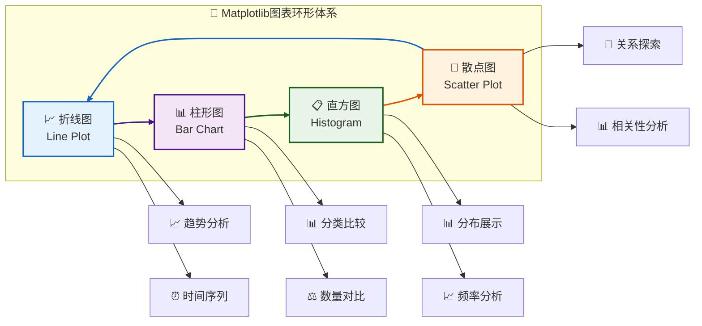

### ⚙️ 绘图工作流程

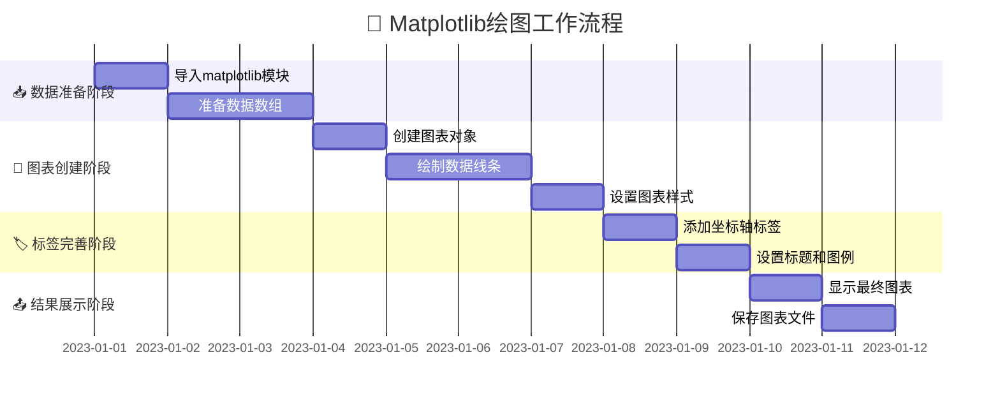

## Matplotlib绘图详解

### 基本图表类型

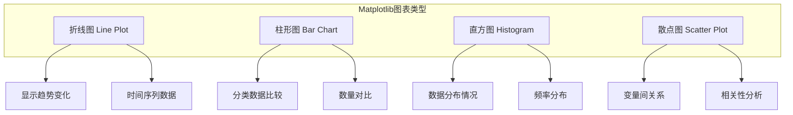

### Matplotlib绘图流程

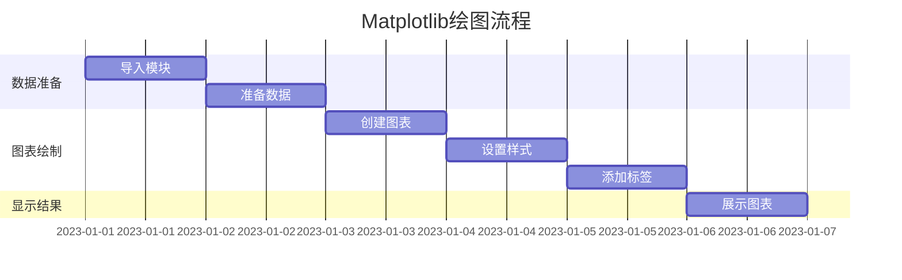

---

## 📊 Seaborn绘图详解

### 🔄 数据分布环形体系

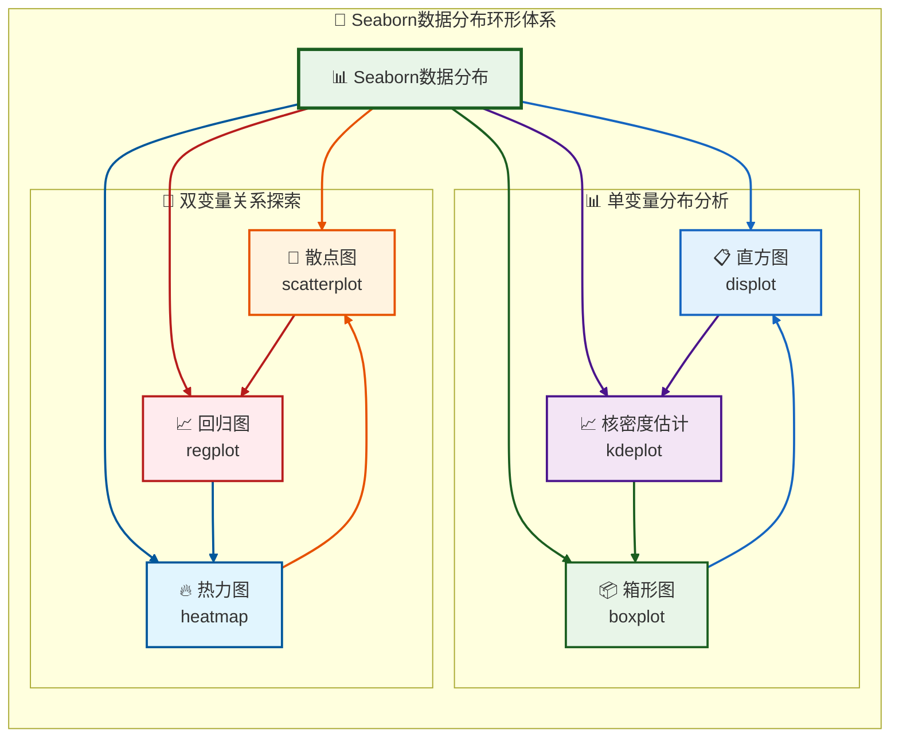

### 🎯 分类数据可视化矩阵

| 📊 图表类型 | 🎯 功能描述 | 📋 适用场景 | ⚙️ 主要函数 |
|-----------|------------|------------|------------|
| **🔵 分类散点图** | 显示分类变量的分布情况 | 分类数据比较分析 | `stripplot()` |
| **🎻 分类内分布** | 展示分类变量内的数据分布 | 组内数据分布分析 | `violinplot()` |
| **📦 箱形图** | 显示数据分布统计信息 | 异常值检测和分布分析 | `boxplot()` |
| **📊 条形图** | 分类数据汇总统计 | 分类统计和比较 | `barplot()` |

### 🌟 Seaborn特色功能

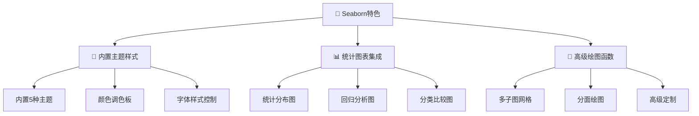

---

## 🌐 Pyecharts绘图详解

### 🔄 交互式图表环形体系

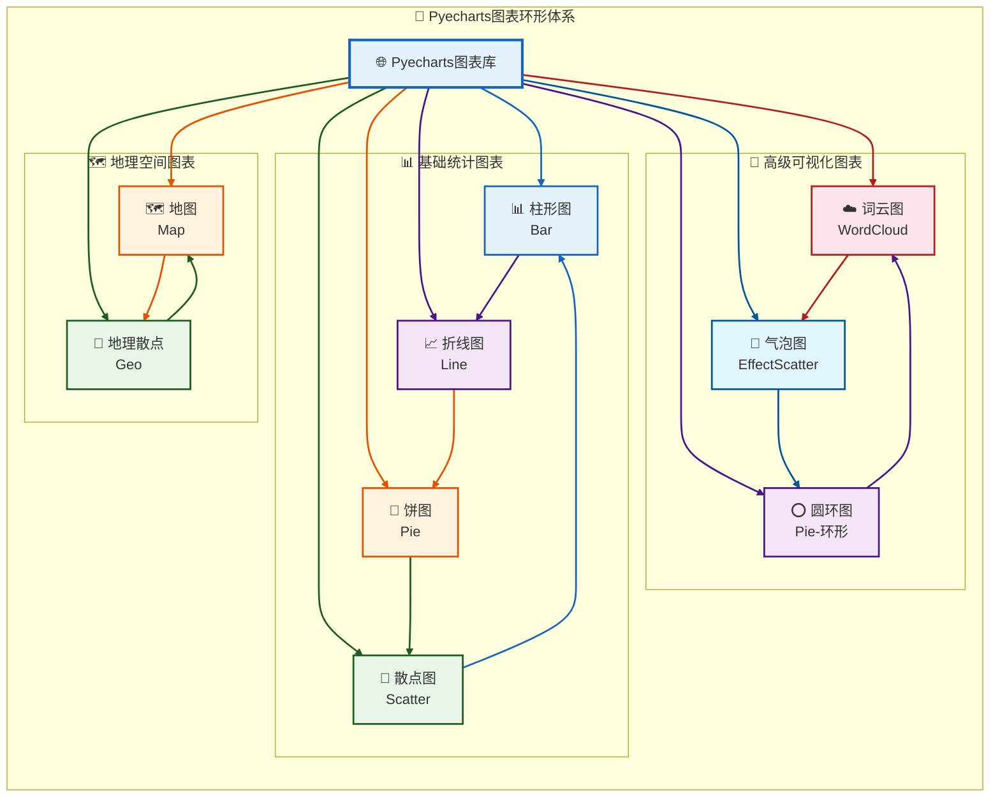

### ⚙️ 图表配置选项矩阵

| 🔧 配置项 | 📋 功能描述 | 🎯 常用参数 |
|----------|------------|------------|
| **📝 标题配置** | 设置图表标题和样式 | `title_opts` |
| **📖 图例配置** | 控制图例显示和位置 | `legend_opts` |
| **📐 坐标轴配置** | 设置坐标轴属性和刻度 | `xaxis_opts`, `yaxis_opts` |
| **💡 工具提示** | 交互式提示信息配置 | `tooltip_opts` |
| **🎨 视觉映射** | 颜色映射和数据关联 | `visualmap_opts` |

### 🌟 Pyecharts核心优势

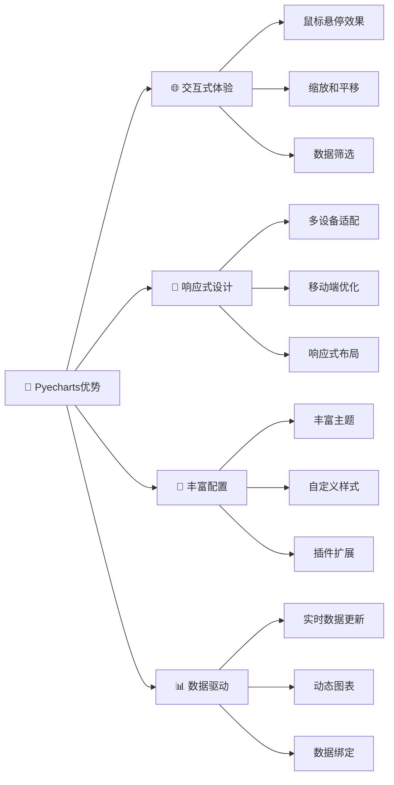

### 🔄 Pyecharts工作流程

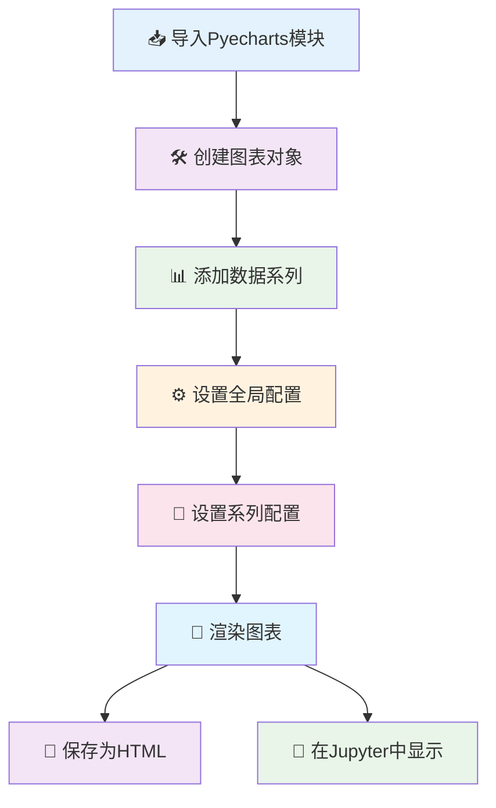

## 🎬 案例：电影数据分析

### 🎯 项目需求分析框架

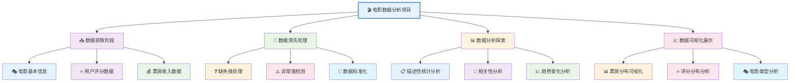

### 🚀 实现步骤路线图

| 🔢 步骤 | 📋 任务描述 | 🛠️ 使用工具 | 📊 输出结果 |
|--------|------------|------------|------------|
| **1️⃣ 数据收集与清洗** | 收集原始数据并进行预处理 | Pandas | 🧹 清洗后数据集 |
| **2️⃣ 探索性数据分析** | 初步探索数据特征和分布 | Matplotlib/Seaborn | 📈 统计图表 |
| **3️⃣ 高级可视化展示** | 创建交互式可视化图表 | Pyecharts | 🌐 交互式图表 |
| **4️⃣ 结果分析与报告** | 综合分析结果并生成报告 | 综合使用 | 📋 分析报告 |

### 🎯 关键分析指标

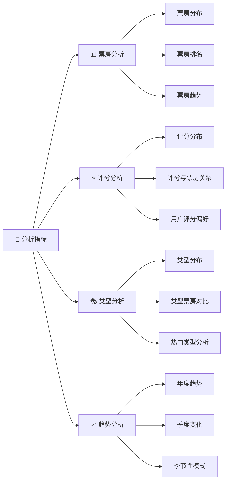

---

## 🔍 工具对比与选择指南

### 📊 三大可视化工具对比矩阵

| 🎯 特性 | 🐍 Matplotlib | 🎨 Seaborn | 🌐 Pyecharts |
|--------|--------------|------------|-------------|
| **📚 学习曲线** | 中等难度 | 简单易学 | 简单上手 |
| **🖱️ 交互性** | 有限交互 | 有限交互 | 强交互性 |
| **🎨 美观度** | 基础样式 | 美观优雅 | 精美现代 |
| **🔧 定制性** | 高度可定制 | 中等定制 | 高度可定制 |
| **📋 适用场景** | 科研图表 | 统计分析 | 商业报告 |
| **💾 输出格式** | PNG/PDF | PNG/PDF | HTML/SVG |
| **⚡ 性能表现** | 高性能 | 中等性能 | 中等性能 |
| **📱 移动端支持** | 有限支持 | 有限支持 | 完全支持 |

### 🎯 智能选择建议

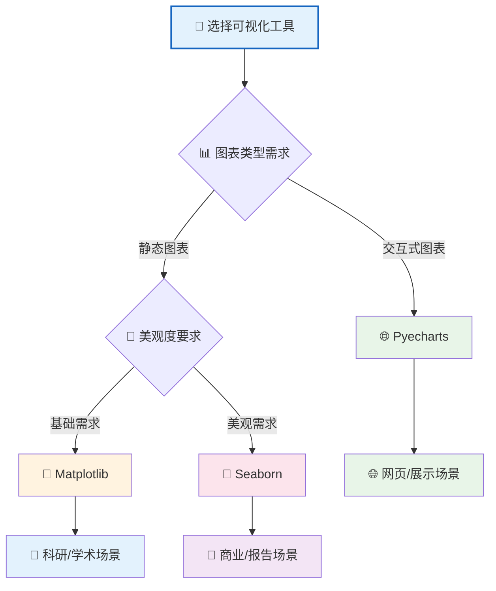

### 🚀 工具组合使用策略

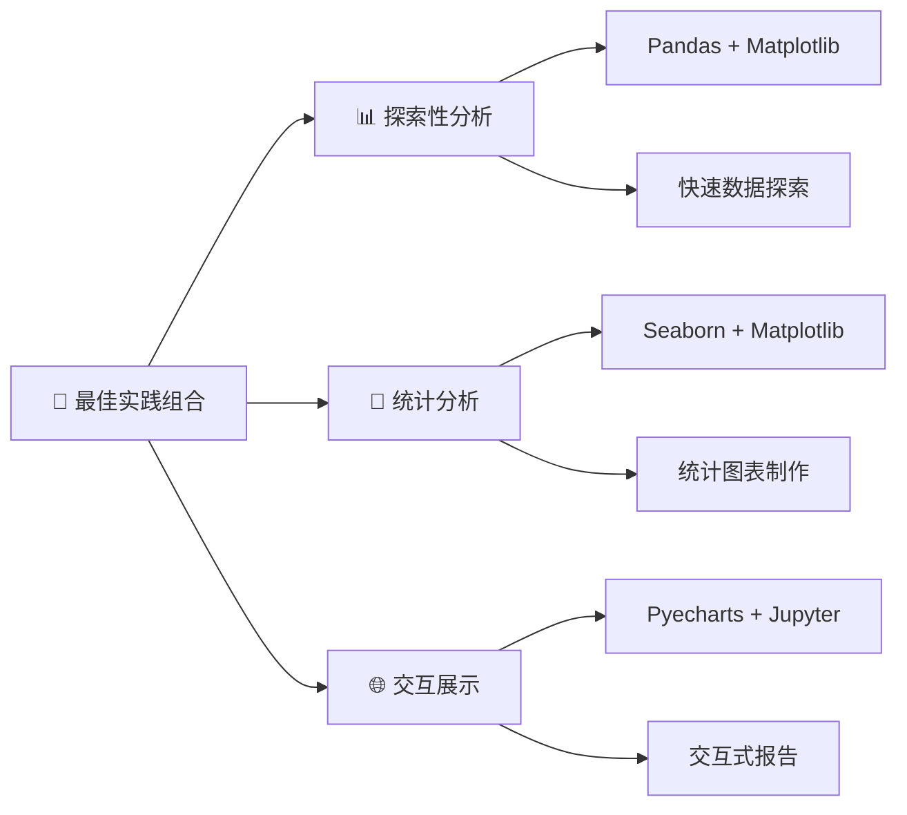

## 可视化最佳实践


## 重点内容总结

### 核心知识点

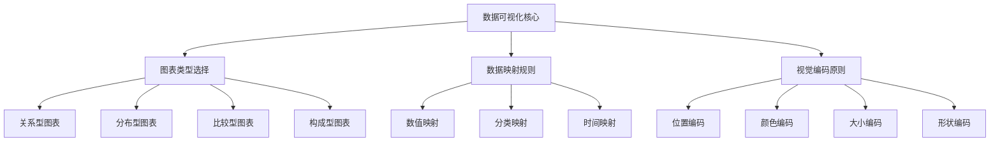

### 🚀 学习路径建议

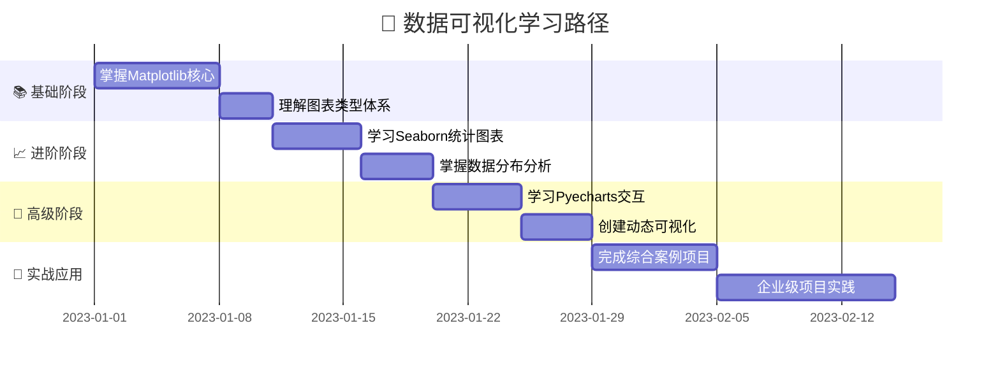

---

## 🎯 章节总结

### 📚 学习成果概览

本章系统性地介绍了Python数据可视化的三大核心工具体系，通过理论与实践相结合的方式，帮助读者构建完整的数据可视化知识框架：

✅ **掌握Matplotlib基础绘图能力** - 从折线图到复杂图表
✅ **理解Seaborn统计可视化优势** - 美观的统计图表制作  
✅ **熟练使用Pyecharts交互功能** - 创建动态可视化体验
✅ **完成电影数据分析实战** - 综合应用可视化技能

### 🌟 关键知识点回顾

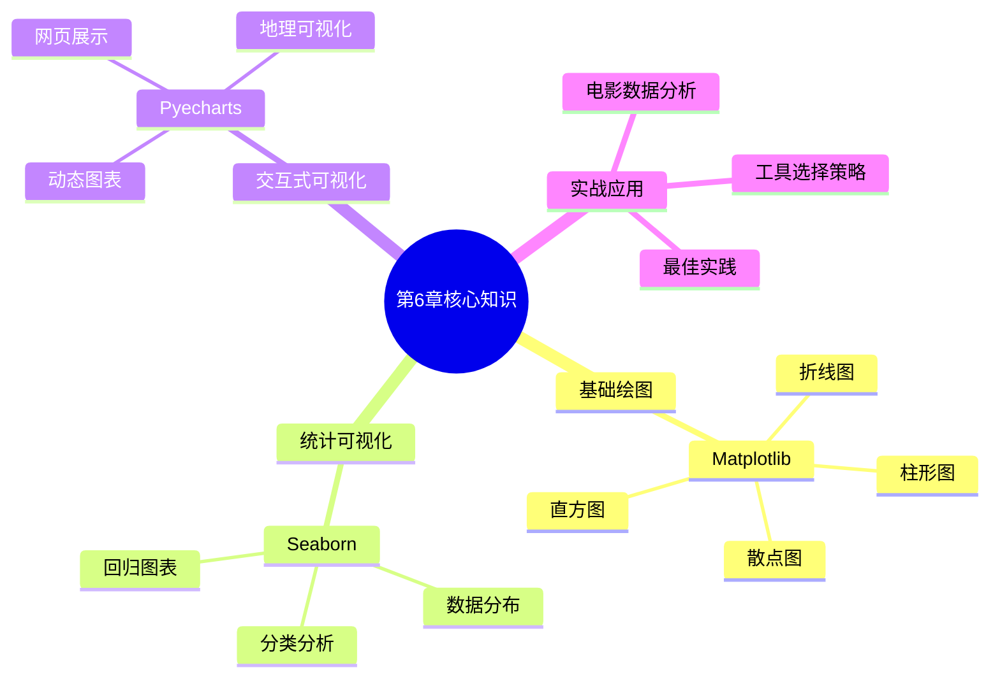

### 🚀 后续学习建议

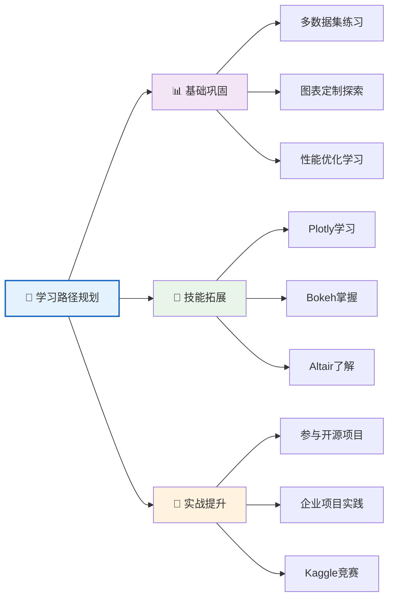

### 💡 实用技巧提醒

| 🔧 技巧类型 | 📋 具体建议 | 🎯 应用场景 |
|-----------|------------|------------|
| **📊 图表选择** | 根据数据类型选择合适图表 | 数据分析初期 |
| **🎨 颜色搭配** | 使用协调的颜色方案 | 报告制作时 |
| **📱 响应式设计** | 考虑不同设备显示效果 | 网页展示项目 |
| **⚡ 性能优化** | 大数据集时注意性能 | 生产环境部署 |

---

## 📞 反馈与支持

如果对本可视化文档有任何建议或发现错误，欢迎通过以下方式反馈：

- 📧 邮箱反馈
- 💬 在线讨论
- 🔧 代码改进建议

---

<div align="center">

**🎉 恭喜完成第6章学习！继续加油！**

</div>