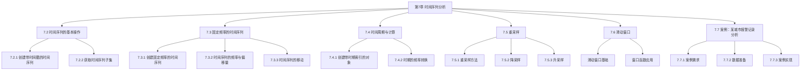
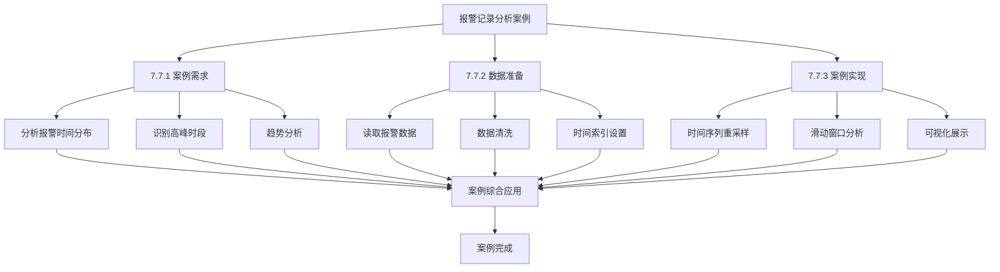
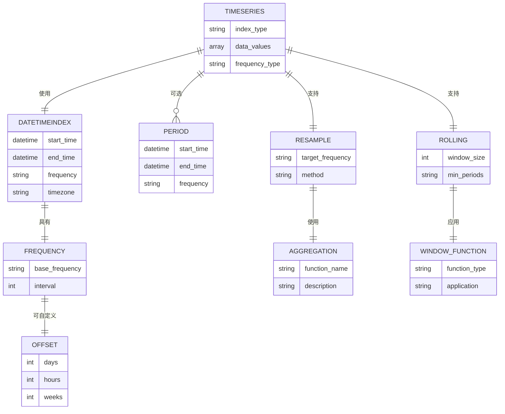

# 第7章 时间序列分析 - 可视化文档

## 章节概述

第7章系统地介绍了Pandas中时间序列分析的核心功能，从基础的时间序列创建到高级的频率控制、重采样和滑动窗口分析，最后通过实际案例进行综合应用。

## 章节结构图



## 详细内容可视化

### 7.2 时间序列的基本操作

#### 7.2.1 创建带时间戳的时间序列

```mermaid
graph TD
    A[创建时间序列] --> B{创建方法}
    
    B -->|日期字符串列表| C[pd.to_datetime<br/>['20230110', '20230115']]
    B -->|datetime对象列表| D[datetime(2023,1,10), datetime(2023,1,15)]
    
    C --> E[生成DatetimeIndex]
    D --> E
    
    E --> F{创建数据结构}
    F -->|Series| G[pd.Series(data, index=date_index)]
    F -->|DataFrame| H[pd.DataFrame(data, index=date_list)]
    
    G --> I[时间序列Series]
    H --> J[时间序列DataFrame]
    
    I --> Z[结束]
    J --> Z
```

**关键方法：**
- `pd.to_datetime()`: 将日期字符串转换为datetime对象
- `pd.Series()`: 创建带时间索引的序列
- `pd.DataFrame()`: 创建带时间索引的数据框

#### 7.2.2 获取时间序列子集

```mermaid
graph TD
    A[获取时间序列子集] --> B{索引方式}
    
    B -->|位置索引| C[iloc[]<br/>基于位置]
    B -->|标签索引| D[loc[]<br/>基于时间标签]
    
    D --> E{时间标签格式}
    E -->|标准格式| F['2020-05-30']
    E -->|紧凑格式| G['20200530']
    E -->|斜杠分隔| H['2020/05/30']
    E -->|美式日期| I['5/30/2020']
    E -->|年份筛选| J['2020']
    
    C --> K[获取单个值]
    F --> K
    G --> K
    H --> K
    I --> K
    J --> L[获取年份所有数据]
    
    K --> Z1[结束]
    L --> Z2[结束]
    
    D --> M[截取范围方法]
    M --> N[truncate()<br/>before/after参数]
    N --> Z3[结束]
```

**关键方法：**
- `iloc[]`: 基于位置的索引
- `loc[]`: 基于标签的索引
- `truncate()`: 截取指定时间范围

### 7.3 固定频率的时间序列

#### 7.3.1 创建固定频率的时间序列

```mermaid
graph TD
    A[创建固定频率序列] --> B{参数配置方式}
    
    B -->|起止日期| C[start='2023-01-01'<br/>end='2023-01-10']
    B -->|起始+数量| D[start='2023-01-01'<br/>periods=5]
    B -->|结束+数量| E[end='2023-01-10'<br/>periods=5]
    
    C --> F[pd.date_range()]
    D --> F
    E --> F
    
    F --> G{频率设置freq}
    G -->|日频| H[D]
    G -->|周频| I[W]
    G -->|月频| J[M]
    G -->|季频| K[Q]
    G -->|年频| L[Y]
    G -->|自定义| M[5D, 3M等]
    
    F --> N[时区设置]
    N --> O[tz='Asia/Hong_Kong']
    
    F --> P[标准化时间]
    P --> Q[normalize=True]
    
    H --> R[生成DatetimeIndex]
    I --> R
    J --> R
    K --> R
    L --> R
    M --> R
    O --> R
    Q --> R
    
    R --> S[创建时间序列]
    S --> Z[结束]
```

**关键方法：**
- `pd.date_range()`: 生成固定频率的日期序列
- `freq`参数：设置时间序列频率
- `tz`参数：设置时区
- `normalize`参数：标准化时间

#### 7.3.2 时间序列的频率与偏移量

```mermaid
graph TD
    A[频率与偏移量] --> B{创建偏移量}
    
    B -->|基础偏移| C[pd.DateOffset<br/>days=14, hours=10]
    B -->|特定偏移| D[pd.offsets.Week<br/>Week(2)]
    B -->|组合偏移| E[Week(2) + Hour(10)]
    
    C --> F[应用偏移量]
    D --> F
    E --> F
    
    F --> G{应用场景}
    G -->|单个时间点| H[datetime + offset]
    G -->|时间序列| I[date_range + offset]
    
    H --> J[生成新时间点]
    I --> K[生成自定义频率序列]
    
    J --> Z1[结束]
    K --> Z2[结束]
```

**关键方法：**
- `pd.DateOffset()`: 创建时间偏移量
- `pd.offsets.Week()`: 创建周偏移量
- 支持偏移量与时间对象的算术运算

#### 7.3.3 时间序列的移动

```mermaid
graph TD
    A[时间序列移动] --> B{移动方向}
    
    B -->|向后移动| C[shift(periods=1)<br/>数据下移]
    B -->|向前移动| D[shift(periods=-1)<br/>数据上移]
    
    C --> E[产生NaN空缺]
    D --> F[产生NaN空缺]
    
    E --> G{填充空缺}
    F --> G
    
    G -->|默认处理| H[保持NaN空缺]
    G -->|指定填充| I[fill_value参数]
    
    H --> J[生成移动后序列]
    I --> J
    
    J --> Z[结束]
```

**关键方法：**
- `shift()`: 移动时间序列数据
- `periods`参数：控制移动步数
- `fill_value`参数：指定填充值

### 7.4 时间周期与计算

#### 7.4.1 创建带时期索引的对象

```mermaid
graph TD
    A[创建时期对象] --> B{创建方式}
    
    B -->|年份时期| C[pd.Period(2023)<br/>表示2023年]
    B -->|年月时期| D[pd.Period('2023/6')<br/>表示2023年6月]
    
    C --> E[时期运算]
    D --> E
    
    E --> F[period + 1<br/>时期加法]
    E --> G[period - 5<br/>时期减法]
    E --> H[period - other_period<br/>时期差]
    
    F --> I[生成时期索引]
    G --> I
    H --> I
    
    I --> J[pd.period_range()<br/>生成时期范围]
    J --> K[创建时期索引序列]
    
    K --> Z[结束]
```

**关键方法：**
- `pd.Period()`: 创建时期对象
- `pd.period_range()`: 生成时期范围
- 时期对象支持算术运算

#### 7.4.2 时期的频率转换

```mermaid
graph TD
    A[时期频率转换] --> B{转换方法}
    
    B -->|起始对齐| C[asfreq('M', how='start')<br/>转换为月初]
    B -->|结束对齐| D[asfreq('M', how='end')<br/>转换为月末]
    
    C --> E[生成新频率时期]
    D --> E
    
    E --> F{转换示例}
    F -->|年转月| G[2022年 → 2022年1月]
    F -->|年转月| H[2022年 → 2022年12月]
    
    G --> I[时期频率转换完成]
    H --> I
    
    I --> Z[结束]
```

**关键方法：**
- `asfreq()`: 转换时期频率
- `how`参数：控制对齐方式（start/end）

### 7.5 重采样

#### 7.5.1 重采样方法

```mermaid
graph TD
    A[重采样操作] --> B{重采样方法}
    
    B -->|均值重采样| C[resample('W-MON').mean()<br/>周均值]
    B -->|求和重采样| D[resample('W-MON').sum()<br/>周总和]
    B -->|最大值重采样| E[resample('W-MON').max()<br/>周最大值]
    B -->|最小值重采样| F[resample('W-MON').min()<br/>周最小值]
    
    C --> G[生成重采样序列]
    D --> G
    E --> G
    F --> G
    
    G --> H{重采样频率}
    H -->|周频| I[W, W-MON等]
    H -->|月频| J[M]
    H -->|季频| K[Q]
    H -->|年频| L[Y]
    
    I --> M[重采样完成]
    J --> M
    K --> M
    L --> M
    
    M --> Z[结束]
```

**关键方法：**
- `resample()`: 重采样操作
- 支持多种聚合方法：mean(), sum(), max(), min()

#### 7.5.2 降采样

```mermaid
graph TD
    A[降采样] --> B{降采样场景}
    
    B -->|高频到低频| C[日数据 → 月数据]
    B -->|多频率聚合| D[日数据 → 周/月/季/年数据]
    
    C --> E[聚合方法]
    D --> E
    
    E --> F[mean()<br/>平均值]
    E --> G[sum()<br/>总和]
    E --> H[max()<br/>最大值]
    E --> I[min()<br/>最小值]
    
    F --> J[生成降采样数据]
    G --> J
    H --> J
    I --> J
    
    J --> Z[结束]
```

#### 7.5.3 升采样

```mermaid
graph TD
    A[升采样] --> B{升采样场景}
    
    B -->|低频到高频| C[月数据 → 日数据]
    B -->|数据插值| D[填充缺失数据]
    
    C --> E[插值方法]
    D --> E
    
    E --> F[ffill()<br/>向前填充]
    E --> G[bfill()<br/>向后填充]
    E --> H[interpolate()<br/>线性插值]
    
    F --> I[生成升采样数据]
    G --> I
    H --> I
    
    I --> Z[结束]
```

**关键方法：**
- `ffill()`: 向前填充
- `bfill()`: 向后填充
- `interpolate()`: 插值填充

### 7.6 滑动窗口

```mermaid
graph TD
    A[滑动窗口分析] --> B{窗口创建}
    
    B -->|固定窗口| C[rolling(window=10)<br/>10期窗口]
    B -->|扩展窗口| D[expanding()<br/>扩展窗口]
    
    C --> E[窗口函数应用]
    D --> E
    
    E --> F[mean()<br/>移动平均]
    E --> G[sum()<br/>移动总和]
    E --> H[std()<br/>移动标准差]
    E --> I[var()<br/>移动方差]
    
    F --> J[生成窗口统计量]
    G --> J
    H --> J
    I --> J
    
    J --> K{窗口特性}
    K -->|边界处理| L[前n-1期为NaN]
    K -->|中心对齐| M[center参数控制]
    
    L --> N[滑动窗口分析完成]
    M --> N
    
    N --> Z[结束]
```

**关键方法：**
- `rolling()`: 创建滑动窗口
- `expanding()`: 创建扩展窗口
- 支持多种统计函数

### 7.7 案例：某城市报警记录分析



## 核心概念关系图



## 学习路径建议


## 总结

第7章系统地介绍了Pandas中时间序列分析的核心功能，从基础的时间序列创建到高级的频率控制、重采样和滑动窗口分析，为时间序列数据分析提供了完整的工具集。通过本章的学习，可以掌握时间序列数据处理和分析的完整流程。